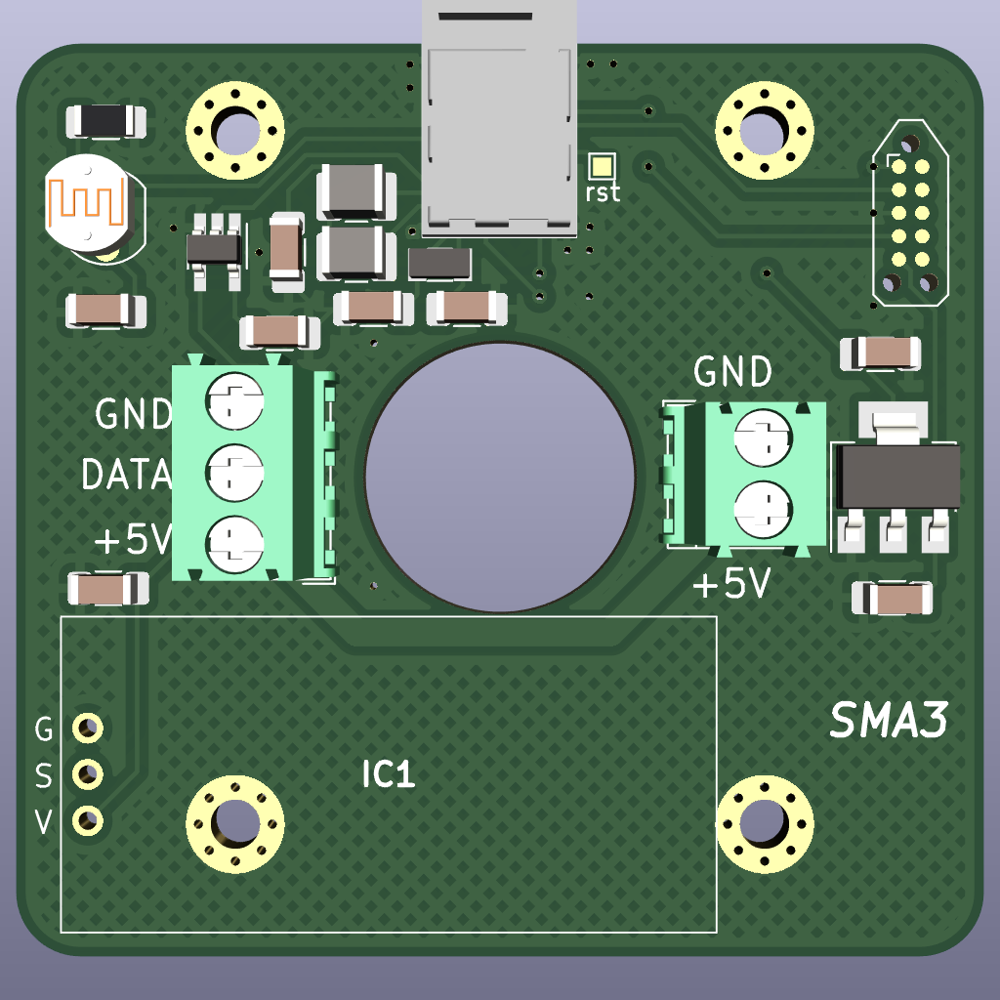

# Sunmachine-A3-pcb
The driver for WS2812, SK6812 or similar LED strips controlled via Bluetooth LE.
It supports both RGB and WWA LEDs. This driver uses motion and light sensors, so in automatic mode
it can turn on the light when it detects someone's presence in the dark. The PCB is designed
for the [Hammond 1551V3](https://www.hammfg.com/electronics/small-case/plastic/1551v) enclosure,
so it can be hung on a wall or ceiling. The firmware for the board is available
in [Sunmachine-A3-fw](https://github.com/gblach/Sunmachine-A3-fw) repo and the mobile app
to control the board is available in [Sunmachine-app](https://github.com/gblach/Sunmachine-app)
repo.

## Key components
- [Raytac MDBT50-512K](https://www.raytac.com/product/ins.php?index_id=111) module with Nordic nRF52833 processor.
- RCWL-0516 microwave motion sensor.
- 5626 photodiode (5526 should work too).
- SN74LV1T34DBV level shifter.
- LM1117-3.3 voltage regulator.

## Connectors
- 2-pin ARK connector - for a power supply (5V).
- 3-pin ARK connector - for a LED strip (max. 6A).
- Tag-Connect 2050 - for a programmer.

## Production files
- [Gerber file](Sunmachine-A3.zip)
- [Bill of materials](Sunmachine-A3.csv)

